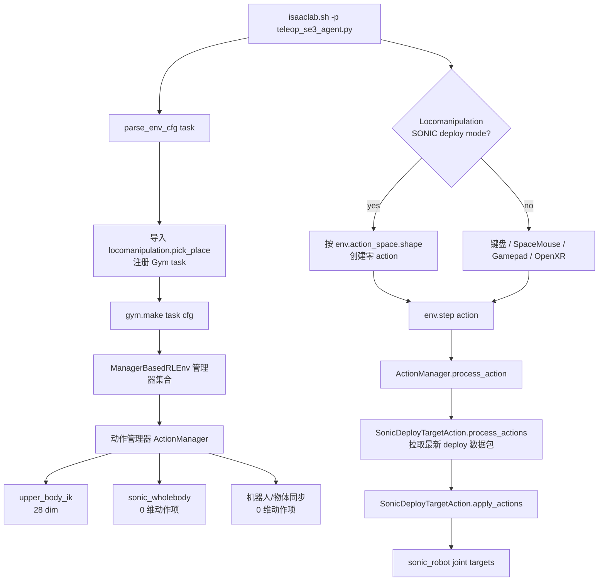
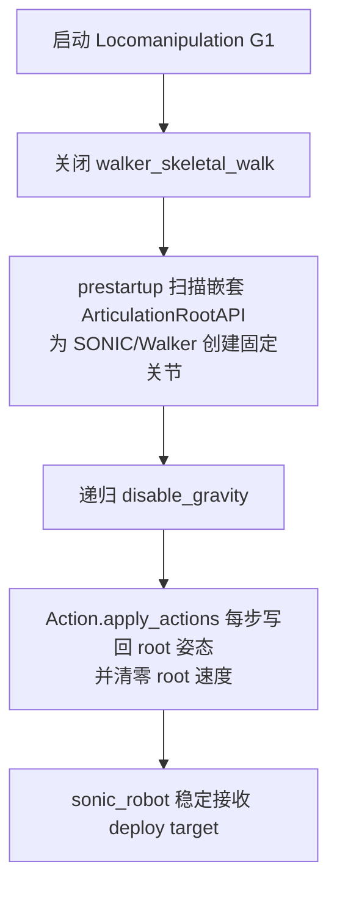
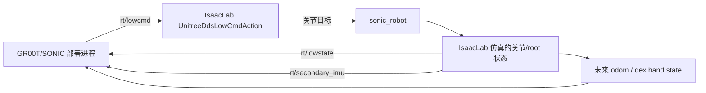

# GR00T/SONIC/PICO 到 IsaacLab Locomanipulation G1 集成框架

本文档描述当前本机联调框架：PICO manager 作为输入源，GR00T/SONIC deploy 作为 whole-body policy 运行端，IsaacLab 的 Locomanipulation G1 场景作为可视化与仿真验证端。

文档主体使用中文说明；项目名、API 名、命令、环境变量、文件路径和 topic 名保持原样，避免和实际代码/命令不一致。

当前目标不是普通 keyboard teleop，而是：

```text
PICO manager -> GR00T/SONIC deploy -> IsaacLab locomanipulation G1
```

短期目标是让 IsaacLab 稳定接收 deploy target 并驱动 `sonic_robot`。长期目标是让 IsaacLab 实现 Unitree DDS 闭环，替代 MuJoCo `run_sim_loop.py` 提供 LowState。

## 总体架构

```mermaid
flowchart LR
    Pico[PICO / XRoboToolkit] --> RoboticsService[robotics service]
    RoboticsService --> PicoManager[pico_manager_thread_server.py]
    PicoManager -->|ZMQ manager 输入 :5556| Deploy[GR00T / SONIC 部署进程]

    Mujoco[MuJoCo run_sim_loop.py<br/>短期 LowState 来源] -->|LowState| Deploy

    Deploy -->|ZMQ 发布 g1_debug.last_action<br/>默认 tcp://127.0.0.1:5557| IsaacTeleop[teleop_se3_agent.py]
    Deploy --> LongDdsCmd[长期 Unitree DDS rt/lowcmd]
    LongDdsCmd --> IsaacTeleop

    IsaacTeleop --> EnvCfg[LocomanipulationG1EnvCfg]
    EnvCfg --> ActionManager[IsaacLab 动作管理器]
    ActionManager --> SonicAction[SonicDeployTargetAction / UnitreeDdsLowCmdAction]
    SonicAction --> SonicRobot[sonic_robot: Unitree G1 29DoF]

    SonicAction --> LongDdsState[长期 DDS rt/lowstate / rt/secondary_imu]
    LongDdsState --> Deploy
```



### 当前默认路径

当前默认走 ZMQ deploy target：

```text
GR00T deploy
  -> ZMQ topic: g1_debug
  -> msgpack field: last_action + body_q_target + base_quat_target
  -> MuJoCo / Unitree motor order 29DoF
  -> IsaacLab SonicDeployTargetAction
  -> remap to IsaacLab/SONIC joint order
  -> set_joint_position_target(sonic_robot)
```

`teleop_se3_agent.py` 在 Locomanipulation deploy 模式下不再使用 keyboard 的 7 维 SE(3) action，而是用：

```python
torch.zeros(env.action_space.shape, device=env.device)
```

这个零 action 只用于推进 IsaacLab 环境时钟和通过 ActionManager 的 shape 检查。真正的 G1 目标由 `SonicDeployTargetAction` 从 ZMQ/DDS 内部消费。

## IsaacLab 内部结构



### 关键代码职责

| 文件 | 责任 |
| --- | --- |
| `scripts/environments/teleoperation/teleop_se3_agent.py` | IsaacLab 启动入口；创建环境；区分普通 teleop 和 SONIC deploy zero-action 模式。 |
| `source/isaaclab_tasks/.../locomanipulation_g1_env_cfg.py` | Locomanipulation G1 场景配置；创建本地/远端/Walker/SONIC G1；选择 ZMQ 或 DDS action。 |
| `source/isaaclab_tasks/.../configs/action_cfg.py` | 定义 `SonicDeployTargetActionCfg` 和 `UnitreeDdsLowCmdActionCfg` 等 action 配置字段。 |
| `source/isaaclab_tasks/.../mdp/actions.py` | ZMQ/DDS target 接收、关节顺序 remap、root 稳定、LowState 发布逻辑。 |
| `source/isaaclab_tasks/.../mdp/events.py` | 场景对齐、传送带/箱子事件、嵌套 articulation root 固定事件。 |

## 运行时序


## 当前调试默认值

当前默认是“deploy target 验证模式”，优先保证机器人不倒、链路可观测：

| 配置 | 默认值 | 含义 |
| --- | --- | --- |
| `SONIC_DEPLOY_TRANSPORT` | `zmq` | 未设置时默认订阅 ZMQ `g1_debug`。 |
| `SONIC_G1_PHYSICS_MODE` | `false` | 默认不做自由根节点物理验证。 |
| `SONIC_G1_FIX_ROOT` | 由 `not SONIC_G1_PHYSICS_MODE` 得到 | 默认固定 `sonic_robot` root。 |
| `LOCIMANIP_ENABLE_WALKER_ROBOT` | `false` | 默认关闭 `walker_skeletal_walk`，避免诊断机器人自由摔倒干扰判断。 |
| `LOCOMANIP_SONIC_REPLACE_ROBOT1` | `true` | banyun 工位由 SONICRobot 顶替 Robot_1（详见下文“工位机器人开关与跨机同步”）。设 `0` 完整恢复 Robot_1 镜像方案。 |

启动时会打印类似：

```text
[locomanip_cfg] SONIC_G1_FIX_ROOT=True SONIC_G1_PHYSICS_MODE=False ENABLE_WALKER_ROBOT=False SONIC_REPLACE_ROBOT1=True ...
```

ActionManager 正常应显示：

```text
Active Action Terms (shape: 28)
```

并且不应出现：

```text
walker_skeletal_walk
```

## 启动命令

推荐按以下顺序启动。

### 1. PICO robotics service

```bash
sudo bash /opt/apps/roboticsservice/runService.sh
```

### 2. MuJoCo LowState 临时来源

GR00T/SONIC deploy 当前仍需要 LowState。短期用 MuJoCo 顶上：

```bash
cd /home/nolo/GR00T-WholeBodyControl
source .venv_teleop/bin/activate
python gear_sonic/scripts/run_sim_loop.py
```

### 3. PICO manager

```bash
cd /home/nolo/GR00T-WholeBodyControl
source .venv_teleop/bin/activate
python gear_sonic/scripts/pico_manager_thread_server.py --manager
```

### 4. GR00T/SONIC deploy

```bash
cd /home/nolo/GR00T-WholeBodyControl/gear_sonic_deploy
source scripts/setup_env.sh
./deploy.sh --input-type zmq_manager --zmq-host localhost sim
```

### 5. IsaacLab

```bash
cd /home/nolo/xiaoyang_IssacLab/IsaacLab
unset SONIC_G1_PHYSICS_MODE
unset LOCIMANIP_ENABLE_WALKER_ROBOT

export SONIC_DEPLOY_TRANSPORT=zmq
export SONIC_DEPLOY_ENDPOINT=tcp://127.0.0.1:5557
export SONIC_DEPLOY_TOPIC=g1_debug
export SONIC_DEPLOY_TARGET_FIELD=last_action
export SONIC_DEPLOY_TARGET_RATE_LIMIT=0.16
export SONIC_DEPLOY_REFERENCE_TARGET_FIELD=body_q_target
export SONIC_DEPLOY_BLEND_REFERENCE_LOWER_BODY=1
export SONIC_DEPLOY_HOLD_LAST_REFERENCE=1
export SONIC_DEPLOY_FOLLOW_BASE_YAW=1
export SONIC_DEPLOY_FOLLOW_BASE_TRANSLATION=1
export SONIC_DEPLOY_BASE_TRANSLATION_RATE_LIMIT=0.08
export SONIC_DEPLOY_BASE_TRANSLATION_SCALE=2.0
export SONIC_DEPLOY_SYNTHETIC_BASE_MOTION=1

./isaaclab.sh -p scripts/environments/teleoperation/teleop_se3_agent.py \
  --task Isaac-PickPlace-Locomanipulation-G1-Abs-v0 \
  --enable_pinocchio
```

`SONIC_DEPLOY_TRANSPORT` 不显式设置时也会按 `zmq` 处理；这里显式写出是为了让运行状态更清楚。

## 数据与关节顺序

deploy ZMQ 包当前消费字段：

| 字段 | 含义 |
| --- | --- |
| topic | `g1_debug` |
| payload format | msgpack map |
| target field | `last_action` |
| lower/waist reference field | `body_q_target` |
| fixed-root yaw field | `base_quat_target` |
| fixed-root translation field | `base_trans_target` |
| target dim | 29 |
| input order | MuJoCo / Unitree motor order |
| IsaacLab action term | `SonicDeployTargetAction` |

`SonicDeployTargetAction` 会把 MuJoCo / Unitree 顺序 remap 到 IsaacLab/SONIC joint order，然后写入 `sonic_robot` 的 joint position target。
直接 GR00T/SONIC deploy 默认用 `last_action` 驱动上肢，因为它是已经按 `g1_action_scale + default_angles` 转成电机 q 的实际策略输出。为了让 fixed-root 可视化机器人也能转身和行走，当前会用 `body_q_target` 覆盖腿部和腰部目标，用 `base_quat_target` 的相对 yaw 旋转 root，并用 `base_trans_target` 的相对 XY 平移 root。

注意（2026-07-13 修复）：`base_trans_target` 的相对 XY 位移位于 deploy odom 系（机器人初始朝向为其 +X）。IsaacLab 侧现在会把该位移按（锚定 yaw − deploy 初始 yaw）旋转进世界系再叠加到锚点上——此前缺这步旋转，SONIC 机器人恒等朝向出生时被掩盖；工位化后出生朝向 +90°（面向 +Y），不旋转会导致 fixed-root 机器人相对自身朝向"横着走"。yaw 跟随与 synthetic 平移路径本来就是增量式/带朝向旋转的，不受影响。

如果 deploy 偶尔发送空的 `body_q_target`，IsaacLab 默认保持上一帧有效下半身 reference，避免腿和腰抖回 `last_action`。如果 `base_trans_target` 长时间静止，但腿部 reference 已经在走，IsaacLab 会从下半身目标变化合成一个小的可视 root 平移，让固定 root 调试模式下也能看出“向前走”的效果。这个合成平移只用于 ZMQ target 可视化调试；长期物理正确路径仍然是 Unitree DDS 闭环，由 IsaacLab 发布 LowState 让 deploy 自己闭环产生稳定步态。

## 稳定策略

当前不是在验证完整动态平衡，而是在验证 whole-body target 链路。因此默认启用三层稳定：



如果要进入物理验证模式：

```bash
export SONIC_G1_PHYSICS_MODE=1
export LOCIMANIP_ENABLE_WALKER_ROBOT=1  # 只有需要 walker 诊断时再打开
```

物理模式下机器人是否能站住取决于完整闭环状态、控制律、接触模型、延迟和 LowState 质量；不应和当前 deploy target 链路验证混为一谈。

## 工位机器人开关与跨机同步

2026-07-13 起，主任务 `Isaac-PickPlace-Locomanipulation-G1-Abs-v0` 的 banyun 工位机器人可由环境变量 `LOCOMANIP_SONIC_REPLACE_ROBOT1` 切换（定义在 `locomanipulation_g1_env_cfg.py`）：

| 开关 | 工位机器人 | 驱动链 | 联动变化 |
| --- | --- | --- | --- |
| `1`（默认） | SONICRobot（G1 29DoF，出生 (-3.8, 19.008, 0.76)，面向 +Y） | `sonic_wholebody`（SONIC deploy） | `mujoco_g1_mirror_1` 下线；gripper 同步只挂 robot_2 相关项；success 判定主体改为 `sonic_robot`；XR 第一视角锚到 `SONICRobot/torso_link/head_link`（29DoF g1.usd 的 head_link 嵌套在 torso_link 下，与 43DoF 不同，抄错会静默失效） |
| `0` | Robot_1（GR00T 43DoF 镜像） | `mujoco_g1_mirror_1`（MuJoCo 镜像流） | 完整恢复原方案；SONICRobot 退回南侧 8m 行走通道出生点 (-2.0, 11.008) |

注意 SONIC 出生高度 Z=0.76 是 29DoF 标定值（脚底离地约 9mm），勿抄 43DoF 的 0.78——物理模式下脚穿地会触发 PhysX depenetration 弹射。

### 跨机同步（SONIC 行走 + 对端可见）

默认开关下两台 IsaacLab 都没有 `mujoco_g1_mirror_1`，对端（`ISAACLAB_LOCAL_ROBOT_ID=2`）原本会看到工位机器人静止。为此新增 `ZmqRobotSyncAction`（`zmq_object_sync.py`），复用对象同步的基建：

```text
ID=1（SONIC 物理行走机）
  -> 每 env 步（50Hz）发布 sonic_robot 根位姿 + 29 关节角（JSON）
  -> 与推车/箱子共用同一 PUB socket（ISAACLAB_OBJECT_SYNC_ENDPOINT，默认端口 15555）
  -> topic = sonic_robot
ID=2（对端）
  -> 订阅后纯运动学跟随：写根位姿 + 关节状态，PD 目标同步指向同一姿态
```

实现要点（改动时勿破坏）：

- `sonic_robot_sync` 在 `ActionsCfg` 中必须声明在 `sonic_wholebody` 之后：订阅端收不到 deploy 包时 `sonic_wholebody` 每个物理子步把根位姿写回出生锚点，靠同一子步内后写覆盖前写才能接管（ActionManager 按 cfg 字段声明顺序迭代，root pose 为即时写、joint target 为末次生效的缓冲写——已对照 `action_manager.py` / `articulation.py` / `configclass.py` 源码核实）。
- 订阅端缓存最近状态并**逐物理子步（200Hz）重放**，这不是冗余：`sonic_wholebody` 逐子步写回锚点，只有同频覆盖才能全程压住；且若只在收到新包的帧才写，两机 50Hz 相位差会让无包帧闪回出生点（肉眼可见抖动）。
- 发布端通过 `process_actions` 置标志节流到 env 步频（50Hz）——`apply_actions` 实际在 decimation 循环内以物理步频被调，不节流会 4 倍冗余发包。
- 关节顺序按发布端 `joint_names` 映射到本地（同款 USD 时为恒等映射），首包建立映射并打印 `[ZMQ Robot Sync] first packet applied`；名单缺本地关节或维度不符时**退化为只同步根位姿**（一次性警告，名单变化后重试），不会整包丢弃。
- 订阅端 `sonic_wholebody` 的摔倒自动恢复默认关闭（`SONIC_DEPLOY_AUTO_RECOVER` 显式设置可强制开）：root 高度来自同步流，对端摔倒会让本地 recover 状态机 50Hz 空转刷屏，其写入随即被同步流覆盖、毫无效果。
- `action_dim=0`，不影响 teleop 零动作循环；单机运行时发布端没有订阅者，ZMQ 直接丢包，无额外开销。

对端（ID=2）使用要求：保持默认配置（不要设 `SONIC_G1_PHYSICS_MODE=1`，固定根 + 关重力正适合运动学跟随），并确保 `ISAACLAB_OBJECT_SYNC_ENDPOINT`（或 `WINDOWS_ROBOT_1_ISAACLAB_IP`）指向 ID=1 机器——与物体同步同一配置，物体能同步机器人就能同步。

若需要经典 Robot_1 双机镜像（双 MuJoCo 操作员），在**两台机器**上都设 `LOCOMANIP_SONIC_REPLACE_ROBOT1=0`；两台开关不一致会导致两边场景实体不一致。

## 长期 DDS 闭环方向

长期目标是让 IsaacLab 直接扮演 Unitree G1 simulator：



需要补齐的长期事项：

- IsaacLab 发布结构完整、频率稳定的 `rt/lowstate`。
- IMU、root pose、joint state 与 deploy 期望对齐。
- 如果 deploy 需要 CRC，IsaacLab DDS 侧需要补 Unitree CRC。
- Dex3 / hand command 与 hand state 需要接入。
- MuJoCo `run_sim_loop.py` 退出链路，由 IsaacLab 独立提供状态闭环。

## 常见现象与判断

| 现象 | 判断 |
| --- | --- |
| `Invalid action shape, expected: 28, received: 7` | teleop 没进入 deploy zero-action 模式；检查 `teleop_se3_agent.py` 是否加载当前版本。 |
| ActionManager 里出现 `walker_skeletal_walk` | walker 诊断被打开，可能会看到诊断机器人摔倒。默认 deploy 验证不应出现它。 |
| `packets=0` | IsaacLab 没收到 deploy ZMQ 包；检查 deploy 是否运行、endpoint/topic 是否一致。 |
| 机器人不倒但关节不动 | root 稳定正常，但 target 没进来或 target 等于默认姿态。 |
| 没有 `[locomanip_cfg]` 打印 | 运行的可能不是当前 `/home/nolo/xiaoyang_IssacLab/IsaacLab` 源码。 |
| 对端 `sonic_robot` 站着不动 | 跨机同步没通：检查 `ISAACLAB_OBJECT_SYNC_ENDPOINT` 是否指向 ID=1 机器、对端日志是否出现 `[ZMQ Robot Sync] first packet applied`。 |
| 主任务 `--teleop_device handtracking` 启动即退（`'dict' object has no attribute 'repeat'`） | 主任务的 `teleop_devices` 不能加无 retargeter 的 `handtracking` 键——动作维度非零的配置下主循环会拿到 raw dict。缺失设备名会自动回退 `motion_controllers`（XR 锚点同样生效），这是预期路径。 |
| fixed-root 机器人相对自身朝向"横着走" | 老版本 `actions.py` 未把 `base_trans_target` 位移按出生 yaw 旋转（2026-07-13 已修复）；确认运行的是当前源码。 |

## 代码边界

当前实现的边界是：

- `teleop_se3_agent.py` 只负责启动、创建 env、选择 zero-action 或 teleop device。
- deploy target 的网络接收和关节目标应用在 action term 内完成。
- G1 是否固定、walker 是否启用由 `locomanipulation_g1_env_cfg.py` 的环境变量决定。
- 本机 IP / OpenXR 网络配置在 `network_runtime_cfg.py`，属于本地运行配置，不应混入功能提交。

## 更新记录

### 2026-07-13：SONIC 顶替工位机器人 + 跨机同步

- 新增 `LOCOMANIP_SONIC_REPLACE_ROBOT1` 开关（默认 `1`）：SONICRobot 顶替 Robot_1 站 banyun 工位，场景实体、mirror_1 动作、gripper 条件挂载、success 判定主体、XR 锚点五处联动；设 `0` 完整恢复原方案。见"工位机器人开关与跨机同步"。
- 修复 `mdp/actions.py` `follow_base_translation_target`：deploy odom 系 XY 位移现按（锚定 yaw − deploy 初始 yaw）旋转进世界系，修掉非零出生朝向下 fixed-root 机器人"横着走"的问题（恒等出生时行为不变）。
- 新增 `ZmqRobotSyncAction`（`zmq_object_sync.py`）：sonic_robot 根位姿 + 关节角跨机同步，对端运动学跟随；订阅端缓存并逐子步重放防闪回。
- 踩坑记录：主任务 `teleop_devices` 不要加无 retargeter 的 `handtracking` 键（raw dict 会崩掉动作维度非零的配置），靠 `teleop_se3_agent.py` 的 motion_controllers 回退即可。
- 审查后修复（多智能体审查确认，均 minor 级）：发布端节流到 env 步频（`apply_actions` 实际按物理步频 200Hz 被调，原实现 4 倍冗余发包）；关节名不匹配从"整包丢弃 + 200Hz 刷警告"改为退化只同步根位姿 + 一次性警告；订阅端 `sonic_wholebody` 摔倒自动恢复默认关闭（对端摔倒时本地 recover 状态机会 50Hz 空转刷屏）。
