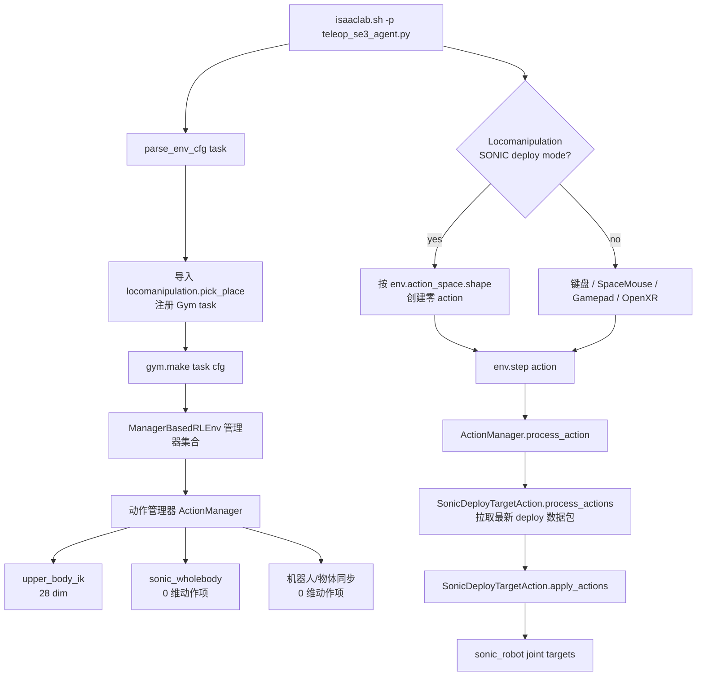
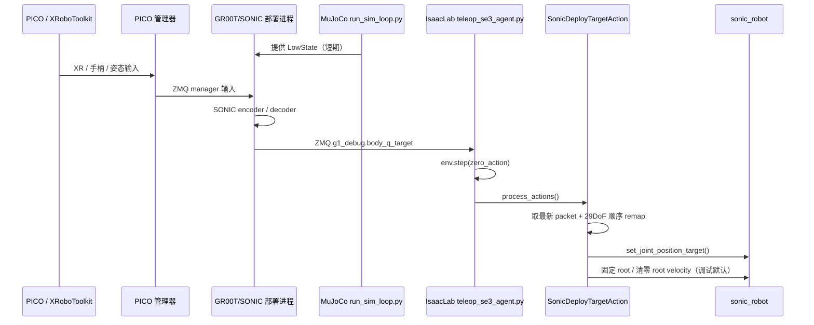
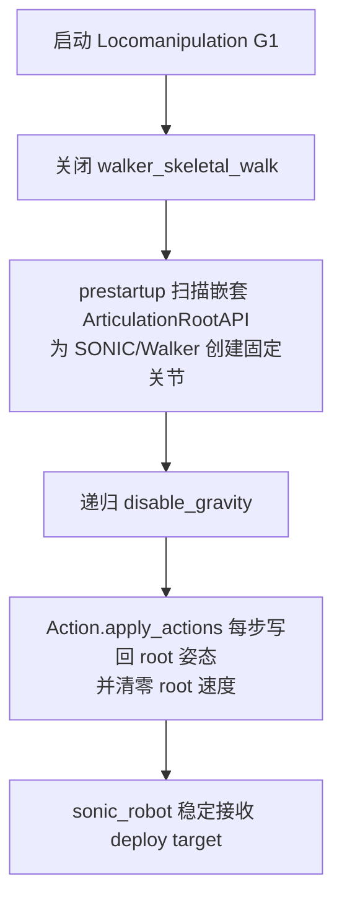
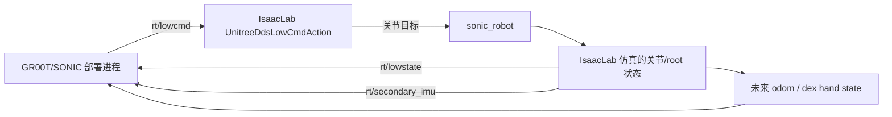

# GR00T/SONIC/PICO 到 IsaacLab Locomanipulation G1 集成框架

本文档描述当前本机联调框架：PICO manager 作为输入源，GR00T/SONIC deploy 作为 whole-body policy 运行端，IsaacLab 的 Locomanipulation G1 场景作为可视化与仿真验证端。

文档主体使用中文说明；项目名、API 名、命令、环境变量、文件路径和 topic 名保持原样，避免和实际代码/命令不一致。

当前目标不是普通 keyboard teleop，而是：

```text
PICO manager -> GR00T/SONIC deploy -> IsaacLab locomanipulation G1
```

短期目标是让 IsaacLab 稳定接收 deploy target 并驱动 `sonic_robot`。长期目标是让 IsaacLab 实现 Unitree DDS 闭环，替代 MuJoCo `run_sim_loop.py` 提供 LowState。

## 总体架构


### 当前默认路径

当前默认走 ZMQ deploy target：

```text
GR00T deploy
  -> ZMQ topic: g1_debug
  -> msgpack field: body_q_target
  -> MuJoCo / Unitree motor order 29DoF
  -> IsaacLab SonicDeployTargetAction
  -> remap to IsaacLab/SONIC joint order
  -> set_joint_position_target(sonic_robot)
```

`teleop_se3_agent.py` 在 Locomanipulation deploy 模式下不再使用 keyboard 的 7 维 SE(3) action，而是用：

```python
torch.zeros(env.action_space.shape, device=env.device)
```

这个零 action 只用于推进 IsaacLab 环境时钟和通过 ActionManager 的 shape 检查。真正的 G1 目标由 `SonicDeployTargetAction` 从 ZMQ/DDS 内部消费。

## IsaacLab 内部结构



### 关键代码职责

| 文件 | 责任 |
| --- | --- |
| `scripts/environments/teleoperation/teleop_se3_agent.py` | IsaacLab 启动入口；创建环境；区分普通 teleop 和 SONIC deploy zero-action 模式。 |
| `source/isaaclab_tasks/.../locomanipulation_g1_env_cfg.py` | Locomanipulation G1 场景配置；创建本地/远端/Walker/SONIC G1；选择 ZMQ 或 DDS action。 |
| `source/isaaclab_tasks/.../configs/action_cfg.py` | 定义 `SonicDeployTargetActionCfg` 和 `UnitreeDdsLowCmdActionCfg` 等 action 配置字段。 |
| `source/isaaclab_tasks/.../mdp/actions.py` | ZMQ/DDS target 接收、关节顺序 remap、root 稳定、LowState 发布逻辑。 |
| `source/isaaclab_tasks/.../mdp/events.py` | 场景对齐、传送带/箱子事件、嵌套 articulation root 固定事件。 |

## 运行时序



## 当前调试默认值

当前默认是“deploy target 验证模式”，优先保证机器人不倒、链路可观测：

| 配置 | 默认值 | 含义 |
| --- | --- | --- |
| `SONIC_DEPLOY_TRANSPORT` | `zmq` | 未设置时默认订阅 ZMQ `g1_debug`。 |
| `SONIC_G1_PHYSICS_MODE` | `false` | 默认不做自由根节点物理验证。 |
| `SONIC_G1_FIX_ROOT` | 由 `not SONIC_G1_PHYSICS_MODE` 得到 | 默认固定 `sonic_robot` root。 |
| `LOCIMANIP_ENABLE_WALKER_ROBOT` | `false` | 默认关闭 `walker_skeletal_walk`，避免诊断机器人自由摔倒干扰判断。 |

启动时会打印类似：

```text
[locomanip_cfg] SONIC_G1_FIX_ROOT=True SONIC_G1_PHYSICS_MODE=False ENABLE_WALKER_ROBOT=False ...
```

ActionManager 正常应显示：

```text
Active Action Terms (shape: 28)
```

并且不应出现：

```text
walker_skeletal_walk
```

## 启动命令

推荐按以下顺序启动。

### 1. PICO robotics service

```bash
sudo bash /opt/apps/roboticsservice/runService.sh
```

### 2. MuJoCo LowState 临时来源

GR00T/SONIC deploy 当前仍需要 LowState。短期用 MuJoCo 顶上：

```bash
cd /home/nolo/GR00T-WholeBodyControl
source .venv_teleop/bin/activate
python gear_sonic/scripts/run_sim_loop.py
```

### 3. PICO manager

```bash
cd /home/nolo/GR00T-WholeBodyControl
source .venv_teleop/bin/activate
python gear_sonic/scripts/pico_manager_thread_server.py --manager
```

### 4. GR00T/SONIC deploy

```bash
cd /home/nolo/GR00T-WholeBodyControl/gear_sonic_deploy
source scripts/setup_env.sh
./deploy.sh --input-type zmq_manager --zmq-host localhost sim
```

### 5. IsaacLab

```bash
cd /home/nolo/xiaoyang_IssacLab/IsaacLab
unset SONIC_G1_PHYSICS_MODE
unset LOCIMANIP_ENABLE_WALKER_ROBOT

export SONIC_DEPLOY_TRANSPORT=zmq
export SONIC_DEPLOY_ENDPOINT=tcp://127.0.0.1:5557
export SONIC_DEPLOY_TOPIC=g1_debug

./isaaclab.sh -p scripts/environments/teleoperation/teleop_se3_agent.py \
  --task Isaac-PickPlace-Locomanipulation-G1-Abs-v0 \
  --enable_pinocchio
```

`SONIC_DEPLOY_TRANSPORT` 不显式设置时也会按 `zmq` 处理；这里显式写出是为了让运行状态更清楚。

## 数据与关节顺序

deploy ZMQ 包当前消费字段：

| 字段 | 含义 |
| --- | --- |
| topic | `g1_debug` |
| payload format | msgpack map |
| target field | `body_q_target` |
| target dim | 29 |
| input order | MuJoCo / Unitree motor order |
| IsaacLab action term | `SonicDeployTargetAction` |

`SonicDeployTargetAction` 会把 MuJoCo / Unitree 顺序 remap 到 IsaacLab/SONIC joint order，然后写入 `sonic_robot` 的 joint position target。

## 稳定策略

当前不是在验证完整动态平衡，而是在验证 whole-body target 链路。因此默认启用三层稳定：



如果要进入物理验证模式：

```bash
export SONIC_G1_PHYSICS_MODE=1
export LOCIMANIP_ENABLE_WALKER_ROBOT=1  # 只有需要 walker 诊断时再打开
```

物理模式下机器人是否能站住取决于完整闭环状态、控制律、接触模型、延迟和 LowState 质量；不应和当前 deploy target 链路验证混为一谈。

## 长期 DDS 闭环方向

长期目标是让 IsaacLab 直接扮演 Unitree G1 simulator：



需要补齐的长期事项：

- IsaacLab 发布结构完整、频率稳定的 `rt/lowstate`。
- IMU、root pose、joint state 与 deploy 期望对齐。
- 如果 deploy 需要 CRC，IsaacLab DDS 侧需要补 Unitree CRC。
- Dex3 / hand command 与 hand state 需要接入。
- MuJoCo `run_sim_loop.py` 退出链路，由 IsaacLab 独立提供状态闭环。

## 常见现象与判断

| 现象 | 判断 |
| --- | --- |
| `Invalid action shape, expected: 28, received: 7` | teleop 没进入 deploy zero-action 模式；检查 `teleop_se3_agent.py` 是否加载当前版本。 |
| ActionManager 里出现 `walker_skeletal_walk` | walker 诊断被打开，可能会看到诊断机器人摔倒。默认 deploy 验证不应出现它。 |
| `packets=0` | IsaacLab 没收到 deploy ZMQ 包；检查 deploy 是否运行、endpoint/topic 是否一致。 |
| 机器人不倒但关节不动 | root 稳定正常，但 target 没进来或 target 等于默认姿态。 |
| 没有 `[locomanip_cfg]` 打印 | 运行的可能不是当前 `/home/nolo/xiaoyang_IssacLab/IsaacLab` 源码。 |

## 代码边界

当前实现的边界是：

- `teleop_se3_agent.py` 只负责启动、创建 env、选择 zero-action 或 teleop device。
- deploy target 的网络接收和关节目标应用在 action term 内完成。
- G1 是否固定、walker 是否启用由 `locomanipulation_g1_env_cfg.py` 的环境变量决定。
- 本机 IP / OpenXR 网络配置在 `network_runtime_cfg.py`，属于本地运行配置，不应混入功能提交。
